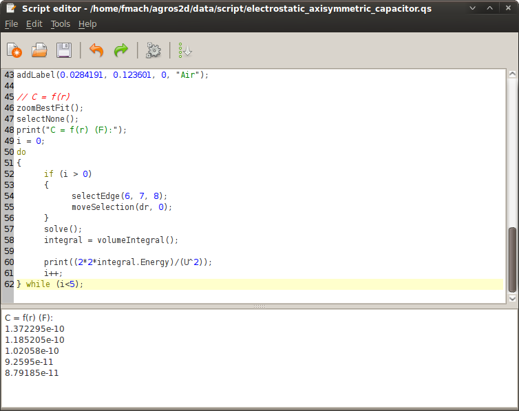

.. highlight:: python
.. _electrostatic-axisymmetric-capacitor:

Electrostatic Axisymmetric Capacitor
====================================

This example demonstrates the basics of scripting in Agros2D. The resulting script can be found if the file */data/scripts/electrostatic_axisymmetric_capacitor.py*.

Introduction
------------

A cylindrical capacitor is a special type of a capacitor, which has electrodes in the form of the concentric cylinders.

For more information visit http://en.wikipedia.org/wiki/Capacitor.

Preprocessing
-------------

Select "Script editor" in the "Tools" menu, or press key F4 and create new solution by command newDocument in form.

.. literalinclude:: ./electrostatic_axisymmetric_capacitor.py
   :lines: 2

It is useful to use local variables in the script.

.. literalinclude:: ./electrostatic_axisymmetric_capacitor.py
   :lines: 5-13

Boundary conditions
^^^^^^^^^^^^^^^^^^^

At first we define boundary conditions. They can be assigned to individual edges in the geometry. The boundary conditions are added with the command addBoundary.

.. literalinclude:: ./electrostatic_axisymmetric_capacitor.py
   :lines: 16-18

Materials
^^^^^^^^^

Next, we define materials and then assign them to the individual areas (labels) in the geometry. The addition of material is carried out with the command addMaterial.

.. literalinclude:: ./electrostatic_axisymmetric_capacitor.py
   :lines: 21-23

Geometry
^^^^^^^^

* Edges

  Use edges to create the desired geometry. The edges are added with the command addEdge.

  .. literalinclude:: ./electrostatic_axisymmetric_capacitor.py
     :lines: 26-38

* Labels

  Use labels to define block labels. The block labels addition is carried out with the command addLabel.

  .. literalinclude:: ./electrostatic_axisymmetric_capacitor.py
     :lines: 41-43

Processing
----------

In this example, we will investigate the dependence of the capacity on the distance of electrodes. For this calculation we will use "do - while" cycle. Type the following code.

.. literalinclude:: ./electrostatic_axisymmetric_capacitor.py
   :lines: 49-64

To run the script select "Run" in the menu "Tools", or by pressing Ctrl+R.

Postprocessing
--------------

After the script is finished the dependence of the capacity on the distance of electrodes will be depicted.

Fig 2.: Calculation of the capacity

Complete script
---------------

.. literalinclude:: ./electrostatic_axisymmetric_capacitor.py
