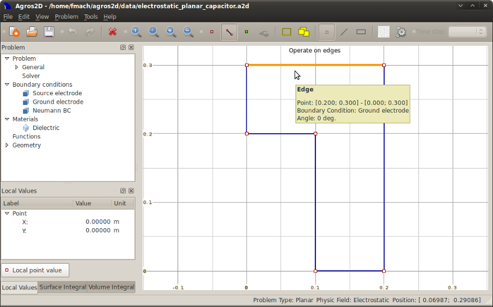
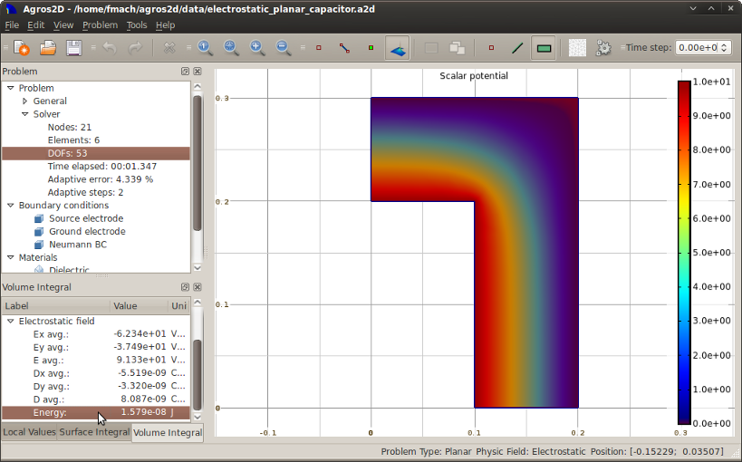

Electrostatic Planar Capacitor
==============================

This example demonstrates the basics of working with Agros2D. The resulting model can be found */data/electrostatic_planar_capacitor.a2d*.

Introduction
------------

Capacitor is a passive electrical component. It consists of electrodes that are separated between dieletric and have a different electrical potential. It is used to store electric charge. The basic type of the capacitor is a plate capacitor.

For more information visit http://en.wikipedia.org/wiki/Capacitor.

Preprocessing
-------------

Select "New" in the menu "File", or in main toolbar and enter "Problem properties".

* Name: Electrostatic planar capacitor
* Date: Actual date
* Problem type: Planar
* Physic field: Electrostatic
* Number of refinements: 1
* Polynomial order: 2
* Adaptivity: hp-adaptivity
* Adaptivity steps: 5
* Adaptivity tolerance: 0.05

.. image:: ./editing_problem.png

Fig. 1.: Editing problem

Geometry
^^^^^^^^

* Nodes

  Select "Operate on nodes" in the "Problem" menu, or in main toolbar and place 6 points with coordinates [0.1, 0.0], [0.2, 0.0], [0.0, 0.2], [0.0, 0.3], [0.1, 0.2] and [0.2, 0.3]. You can move mouse to requested place and press left button together with Ctrl key, or by pressing Alt+N and entering the nodes coordinates.

* Edges

  Select "Operate on edges" in the "Problem" menu, or in main toolbar and draw 6 edges according to definition area. Press Ctrl key and select in sequence start and end node of the line, or by pressing Alt+E and these point select from offer.

* Labels

Select "Operate on labels" in menu "Problem", or in main toolbar and place block label into inner area. To place label you can use left mouse button together with Ctrl key or pressing Alt+L and entering the label point coordinates.

Fig. 2.: Editing geometry

Boundary conditions
^^^^^^^^^^^^^^^^^^^

Select "New boundary condition" from the menu "Problem", or press Alt+B and gradually define three BC, which are described in chapter Problem analysis.

* Name: Source electrode
* BC type: Fixed voltage
* Value: 30

* Name: Ground electrode
* BC type: Fixed voltage
* Value: 0

* Name: Neumann BC
* BC type: Surface charge density
* Value: 0

Materials
^^^^^^^^^

Select "New material" from the menu "Problem", or press Alt+M and define dieletric material embedded between the electrodes.

* Name: Dieletric
* Permitivity: 10
* Charge density (C/m3): 0 

Processing
----------

Mesh
^^^^

Select "Mesh area" from the menu "Problem", or main toolbar.

Solve
^^^^^

Select "Solve problem" from the menu "Problem", or main toolbar.

Postprocessing
--------------

Calculation of capacity
^^^^^^^^^^^^^^^^^^^^^^^

Select "Volume integrals" from the main toolbar and mark area "Dieletric". In subwindow "Volume integral" find value of "Energy" in group "Electostatic field".

Fig. 3.: Calculation of energy

Capacity of the capacitor can be calculated according to formula

We = 4 * 1/2 * CU^2,

which can be adjusted to shape

C = 4 * 2 * We/U^2.
