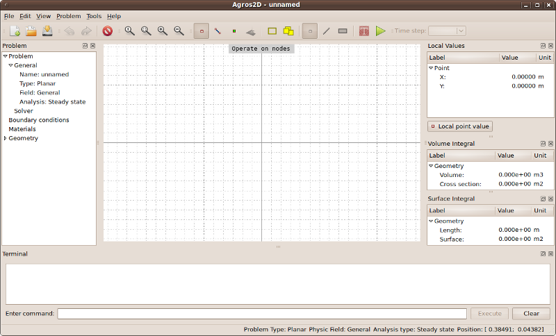
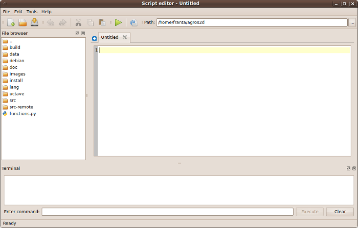
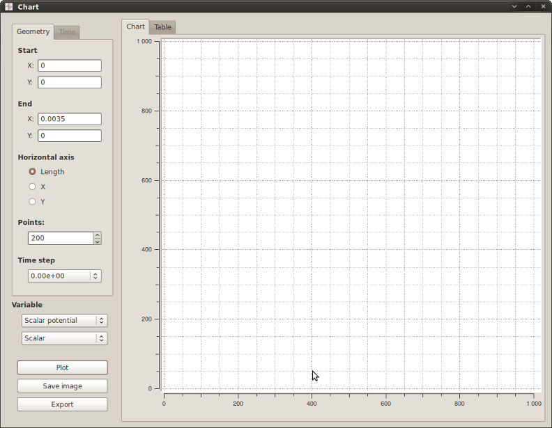

Basic Control
=============

Description of Agros2D
----------------------

Main Window
^^^^^^^^^^^

Main Window consists of several parts.

* Menu Bar and Toolbar

  Menu Bar is the main control element; you can find all commands there. In Toolbar the most frequently used commands are placed.

* Workspace

  Workspace is used for actual work with the model (geometry editing, viewing of the results, etc.). You can use the context menu, which is accessible by double left click in the Workspace area, to select commands from list.

* Problem Panel

  Problem panel displays information about the problem. Here you can use the context menu to perform certain commands. It consists of a tree.

  - Problem

    Here are contained basic information about the problem and its solutions.

  - Boundary conditions

    This part contains a list of added boundary conditions.

  - Materials

    This part contains a list of added materials.

  - Geometry

    Information about elements of geometry that are added to the workspace is contained here.

* Local Values Panel

  This panel displays calculated field quantity of local points.

* Volume Integral Panel

  This panel displays calculated field quantity of volume integrals.

* Surface Integral Panel

  This panel displays calculated field quantity of surface integrals.

* Status Bar

  Status bar is used to display information about the type of problem, solution of the physical field and cursor position in workspace.

Fig. 1.: Main Window

Script Editor Window
^^^^^^^^^^^^^^^^^^^^

The main part of the Script Editor Window is editing area, which works with scripts. In the bottom of the window there is an area for printing script warnings and messages. Script Editor Window also contains the Menu Bar and Toolbar.

Fig. 2.: Script Editor Window

Chart Window
^^^^^^^^^^^^

The main part of the Chart Window is the area to display the chart or data. You can switch among chart and data views through tabs at the top of the area. To enter the necessary data for the chart and to work with it controls on the right side of the window are used.

Fig. 3.: Chart window

Shortcut Keys
-------------

Basic Shortcuts
^^^^^^^^^^^^^^^

* **F4**

  Open script editor.

* **F5**

  Change mode to Operate on nodes.

* **F6**

  Change mode to Operate on edges.

* **F7**

  Change mode to Operate on labels.

* **F8**

  Change mode to Postprocessor.

* **Alt+N**

  Add node using coordinates.

* **Alt+E**

  Add edge using coordinates.

* **Alt+L**

  Add label using coordinates.

* **Alt+B**

  Add boundary condition.

* **Alt+M**

  Add material.

* **Alt+S**

  Solve problem.

Advanced Shortcuts
^^^^^^^^^^^^^^^^^^

* **Ctrl+left click**

  Add elements of geometry use selected (with mouse) coordinates.

* **Ctrl+Shift+N**

  Add elements of geometry use enter selected (with mouse) coordinates.

* **Space**

  Open dialog for set markers (only with selected edges or labels).

* **Shift+left click**

  Move with Workspace (also is possible to use middle mouse button).

Tips
----

Both the Main Window and the Script Editor Window can be customized. For adjustments, use context menu of the Menu Bar or Toolbar (also label of each panel) and choose which parts you want to view.

You can use rulers in Workspace after switching them on in program properties.
