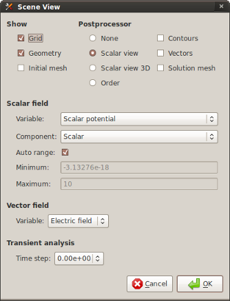

Processing Results
==================

Viewing of Results
------------------

You can display your results using various pre-defined ways. Select "Scene properties" in menu "View" to open dialog "Scene View" or double click in workspace and select this possibility in the context menu.

Fig. 1.: Scene View dialog

Calculation of Field Quantity
-----------------------------

Local values
^^^^^^^^^^^^

For calculation of all available field quantities in point you must first define its coordinates. You can do it by selecting the "Local point value" on the "Local Values" panel.

Surface and volume integrals
^^^^^^^^^^^^^^^^^^^^^^^^^^^^

For calculation of all available field quantities on surface and volume, you have to start by specifying the elements of your geometry which will be included in the calculation. Select "Surface integrals" or "Volume integrals" on "Problem" panel and mark selected parts of the geometry.
