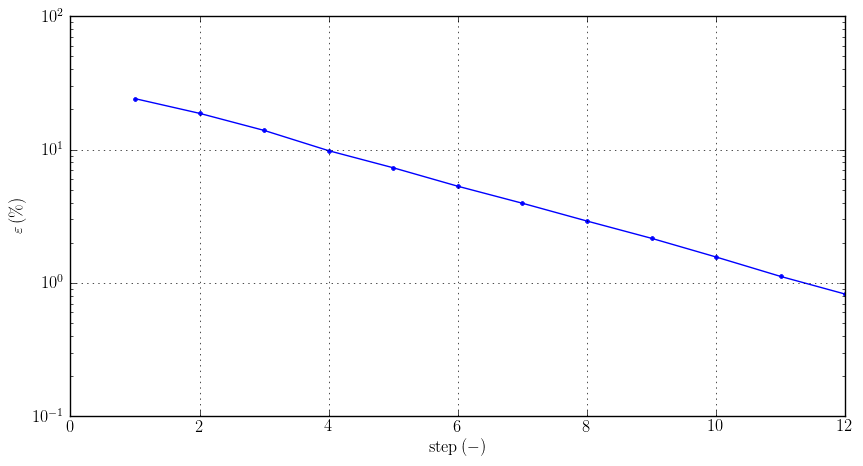
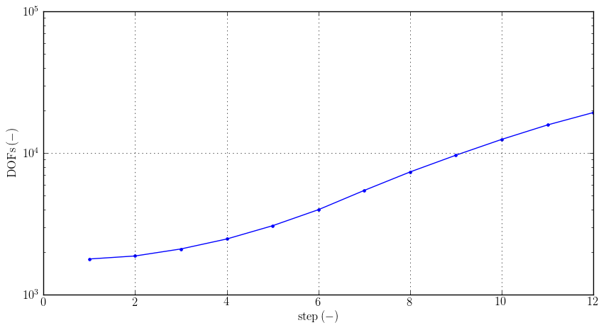

About Agros2D
=============

.. include:: ../basic_information.rst

Key Features
------------

* *hp*-FEM

The *hp*-FEM (higher-order finite element method) is a modern version of the finite element method whitch combines finite elements of variable size (*h*) and polynomial degree (*p*) in order to obtain fast exponential convergence.

* Adaptivity

.. image:: ./adaptivity/convergence.png
   :align: center
   :scale: 50%
   :alt: Convergence

Fig.: Adaptivity charts

* Curvilinear elements

.. image:: ./curvilinear_elements/curvilinear_elements.png
   :align: center
   :scale: 30%
   :alt: Curvilinear elements

.. image:: ./curvilinear_elements/edge_elements.png
   :align: center
   :scale: 30%
   :alt: Edge elements

Fig: Curvilinear (left) and edge (right) elements at the same geometry
