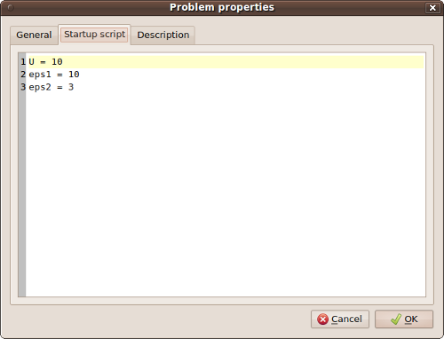

.. highlight:: python

Program Features
================

Import and Export of Geometry
-----------------------------

You can import and export geometry in AutoCAD DXF format. This feature is available in the menu "File". This functionality is based on dxflib_.

User Functions
--------------

You can write your own functions to use in your scripts. If you write these functions to the file *functions.py* in Agros2D root directory, then you will be able to use them in the same way as other commands. You can also use :ref:`predefined-functions`.

.. index:: agros2d-remote

Startup Script
--------------

You can use the variable even if not using scripting. Variables must first define in the Startup script, which can be found in the setting of the problem. After you can use these variables example in dialog for adding new material or boundary conditions.

Fig. 1.: Example of defining variables in Startup script

.. image:: ./boundary_condition.png

Fig. 2.: Example of using variables for adding a new boundary condition

Remote Control
--------------

Agros2D support remote controlling. You can use *agros2d-remote* command for remote controlling of Agros2D.

An example: ::

 agros2d-remote "opendocument("./data/electrostatic_planar_capacitor.a2d")"
 agros2d-remote "solve()"
 agros2d-remote "result = pointresult(0.12, 0.32)"
 agros2d-remote "print(result["V"])"

If you want to run a script file you must use *-script* switch.

An example: ::

 agros2d-remote -script "./data/script/electrostatic_axisymmetric_capacitor.py"

You can use commands described in the section :ref:`scripting`.

Report
------

You can use the automatic generation of reports about solution problems in Agros2D. This feature is available in the menu "Tools". Report is generated to HTML file.

.. _dxflib: http://www.ribbonsoft.com/dxflib.html
