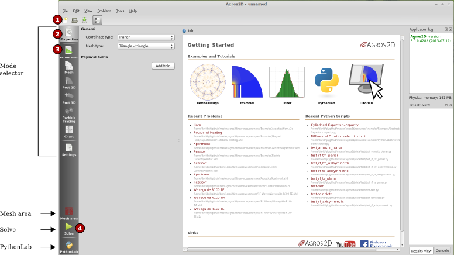
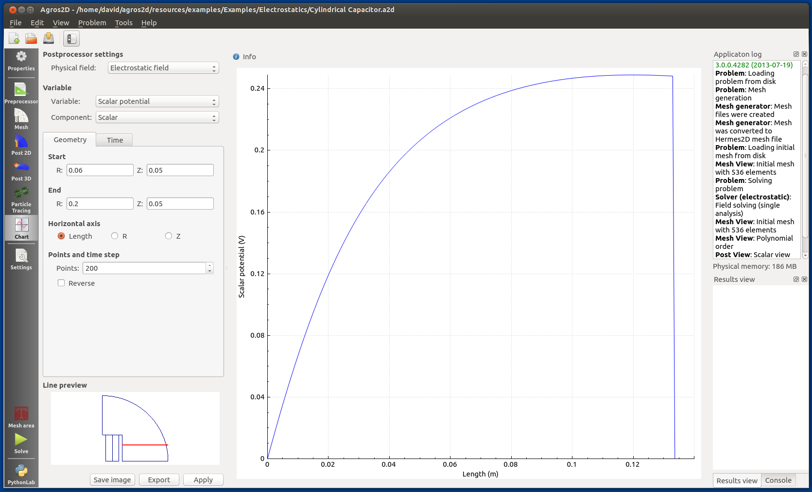
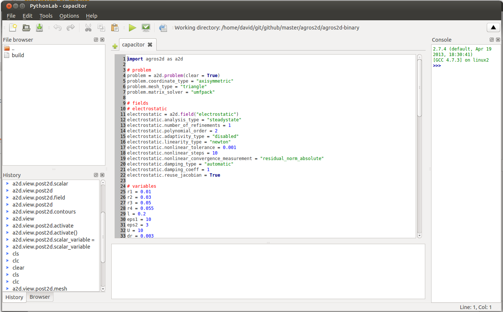

Basic Control
=============

Description of Agros2D
----------------------

Main window
^^^^^^^^^^^
When you start Agros2D, it opens to the *introductory mode* mode, where you can

* create new problem,

* perform basic settings fo the problem and add physical fields, 

* open example problem, 

* run PythonLab and work with scripts. 

   

The important area of the Agros2D interface is *Mode selector*.  There are available four modes:

* Properties  - In this mode it is possible to specify basic properties of the problem. Here you can add physical fields needed by your problem, choose coordinate type, solver type and mesh type. 

* Preprocessor - The main task of the preprocessor is to create geometry and specify physical properties of your problem. 

* Mesh - Mode mesh can be used for viewing meshes.

* Post 2D - In this mode you can work with the solution of your problem. The results are presented as two dimensional color maps, vector fields or contour graphs.

* Post 3D - Enable three dimensional visualiztion of results.

* Particle tracing - Tool for calculating and visualistion of trajectories of particles placed in physical fields.

* Chart - Tool for creating graphs in user defined slices.

* Settings - Configuration of Agros2D.           

Bellow the *Mode selector* are located buttons for running of most important actions. You can create mesh, solve the whole problem, run just one adaptive step or switch to PythonLab which is a tool for work with scripts.  
 

Chart window
^^^^^^^^^^^^

The main part of the chart window is the area to display the chart or data. You can switch among chart and data views through tabs at the top of the area. To enter the necessary data for the chart and to work with it controls on the right side of the window are used.

   
PythonLab
^^^^^^^^^

The main part of the PythonLab is the editing area, which works with scripts. In the bottom of the window there is terminal panel. Script editor window also contains the file browser panel, menu bar and toolbar.

