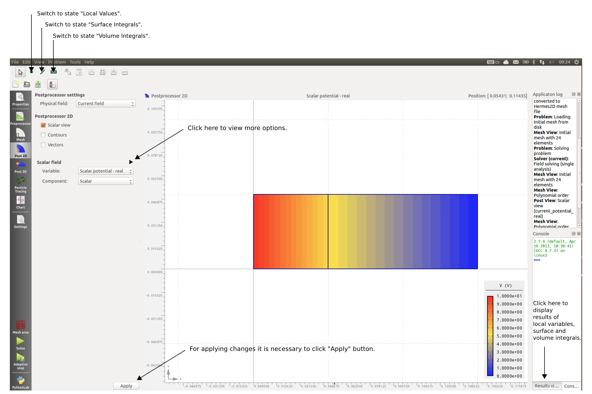

Postprocessing
==============

Once the problem is solved, Agros2d is automatically switched to the mode Postprocessing 2D. In this mode it is possible to display results in different forms.
 
Viewing of Results
------------------

You can display your results using various pre-defined ways. All options can be set using the panel "Postprocessor properties".

   Fig. 1.: Mode Postprocessing 2D

Panel "Postprocessing" depends on solved physical field. For all fields there are posibilies to display scalar variables as a color map, to display contours of scalar fields or to display vector fields.
It is possible to display advanced options which are hidden by default (see Fig. 1).       

Calculation of Field Quantity
-----------------------------
Agros2D can calculate additional values from the solution. There are suported three special states of postprocessor (see Fig. 1)

* Local Values,

* Surface Intgerals,

* Volume Integrals.  

Local values
^^^^^^^^^^^^
For calculation of all available field quantities in point you must first define its coordinates. You can do it by selecting the "Local point value" from the "Problem"  menu.

Surface and volume integrals
^^^^^^^^^^^^^^^^^^^^^^^^^^^^
For calculation of all available field quantities on surface and volume, you have to start by specifying the elements of your geometry which will be included in the calculation. Select "Surface integrals" or "Volume integrals" on "Problem" panel and mark selected parts of the geometry.
