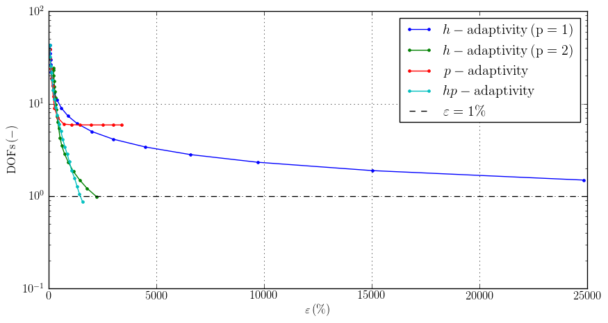
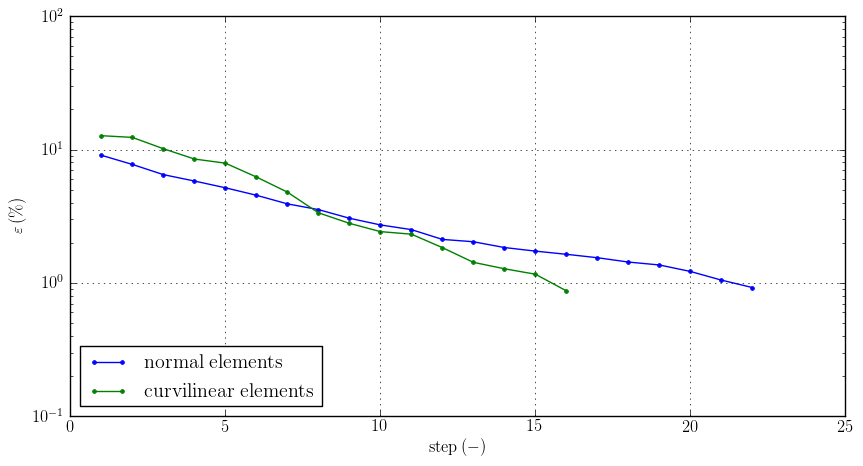
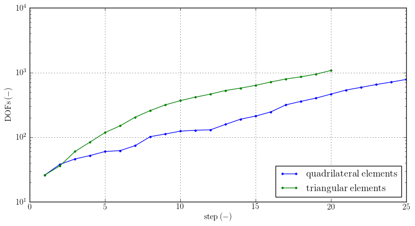

Introduction
============

Agros2D is a multiplatform C++ application for the solution of partial differential equations (PDE) based on the
`Hermes <http://hpfem.org/hermes>`_ library, developed by the `hpfem.org <http://hpfem.org>`_ group at the
`University of West Bohemia in Pilsen <http://www.zcu.cz>`_. Agros2D is distributed under the
`GNU General Public License <http://www.gnu.org/licenses/old-licenses/gpl-2.0.txt>`_.

Supported physical fields
-------------------------
.. sidebar:: Quick start

  If you want to start working with the program Agros2D, go to the page: :ref:`getting_started`.

* :ref:`acoustic` 
* :ref:`current`
* :ref:`elasticity`
* :ref:`electrostatic`
* :ref:`flow`
* :ref:`heat`
* :ref:`magnetic`
* :ref:`rf`

Key Features
------------

Coupled physical fields
^^^^^^^^^^^^^^^^^^^^^^^
For the solution of complex problems, interaction of more physical fields has to be considered. There are two fundamentally different approaches towards this complicated issue, referred to as weak and hard coupling.

* The weak coupling is simpler to implement, since individual fields are calculated separately. In the situation, where terms comprising values of one field are present in the equation describing the other one, but not vice-versa (the case of one-way coupling), this method is usually preferable. In the case of both-way coupling, the use of the weak approach leads to the necessity of several repetitions of consecutive solution of the individual fields, where the values of the second field are taken from the previous iteration. This is obviously rather time-consuming and also the convergence is a big issue. For such problems, the following method is more suitable.

* Using the hard coupling approach, where is no need for iterating, since only one discrete system is created and then solved using linear or nonlinear solver. It is, however, much more complicated to implement and therefore the  majority of finite element codes use some variation of the weak coupling.

This being a rather novel feature of our code, we have implemented and tested three coupling possibilities up to now:

* electric currents and heat transfer,
* magnetic fields and heat transfer,
* heat transfer and structural mechanics.

More options should be available soon. More than two fields may be coupled for complicated problems, such as magnetic, heat and elasticity etc.

Implemented Adaptivity Techniques
^^^^^^^^^^^^^^^^^^^^^^^^^^^^^^^^^
Generally, the algorithms of adaptivity start to be applied at the moment when
some local error of solution is higher than the acceptable tolerance. Consider
an equation

.. math::
   Lf = 0,

where $L$ denotes a differential operator and $f$ a function whose distribution
over some domain $\Omega$ is to be found. If $f$ is its approximation obtained by the
numerical solution of, the absolute and percentage relative errors $\delta$ and $\varepsilon$
are defined by the relations 

.. math::
   \delta = f - f^{\prime}\ \ \ \ \eta = 100\,\left|\frac{\delta}{f}\right|\,.

Not only the above errors can be used for evaluating the quality of the results. Errors can also be estimated by means of norms. Hermes2D works with three of them:

* Basic energetic norm that is defined by the formula

   .. math::
      \|e\| = \left|\int_{\Omega}\delta(L\delta){\,\mathrm{d}}\Omega\right|^{\frac{1}{2}}\,.

* $L^2$ norm defined by the relation

   .. math::
      \|e\|_{L^2} = \left|\int_{\Omega}\delta^2{\,\mathrm{d}}\Omega\right|^{\frac{1}{2}}\,.

* $H^1$ norm defined by the relation

   .. math::
      \|e\|_{H^1} = \left|\int_{\Omega}\left(\delta^2+\grad\delta\cdot\grad \delta\right){\mathrm{d}}\Omega\right|^{\frac{1}{2}}\,.

Unfortunately, the exact solution $f$ is usually known only in very simple, analytically solvable cases. Moreover, there exists no general method that would provide a good estimation of the error for an arbitrary PDE (although for several classes of linear PDEs we can find it). Moreover, in the case of the \textit{hp} adaptivity the traditional error estimate (one number per element) is not enough; we must know its distribution over the whole element. In principle, it might be possible to obtain this information from the estimates of local higher derivatives, but this approach is not very practical. That is why we work with the reference solution $f_{\mathrm{ref}}$ instead, that is
obtained either by a refinement of the whole mesh (*h*-adaptivity), by enlargement of the polynomial degree (*p*-adaptivity) or by both above techniques (*hp*-adaptivity). In this manner we get the candidates for adaptivity even without knowledge of the exact solution $f$. The library Hermes2D works with very sophisticated and subtle tools based on the above considerations.

Before the adaptivity loop is applied, the code must initialize the refinement selector that determines what kind of adaptivity is to be applied. The selector performs the following steps:

* Selection of the candidates for refinement, computation of their local errors, which is realized by projecting the reference solution on their FE spaces.
* Computation of the number of the degrees of freedom for every candidate.
* Evaluation of the score for each candidate and sorting the candidates according to their values.
* Selection of the candidate with the highest score.

As mentioned before, the adaptivity algorithm in Hermes needs an actual mesh solution and another solution realized on globally refined mesh (the reference solution). These solutions are subtracted in each adaptivity step in order to obtain an error estimate (as a function of the position). This function is used to decide which elements need to be refined and in which way. Hence, the adaptivity loop begins with the global refinement of the mesh and calculation of the reference solution.

If the error is higher than a given threshold, the adaptation process is started. The calculated local error in the candidate is first evaluated with respect to the way of adaptivity that should be used. Its weight is selected in the following way:

* $w=2$ for the \textit{h}-adaptivity,
* $w=1$ for the \textit{p}-adaptivity,
* $w=\sqrt{2}$ for the \textit{hp}-adaptivity.

The score $s$ of a candidate is given by the formula

.. math::
   s=\frac{\log_{10}\frac{\varepsilon}{\varepsilon_0}}{(d-d_0)^{\alpha}}\,

where $\varepsilon$ is the estimated error in the candidate, $d$ denotes its number of DOFs, $\varepsilon_0$ and $d_0$ are selected parameters and $\alpha$ stands for the convergence exponent.

The particular kinds of adaptivity are realized in the following manner:

* *h*-adaptivity--while the original large finite element is split to several smaller  elements, the degree of the polynomials replacing the real distribution of the investigated quantity in them remains the same. This is clear from Fig. 1 and Fig. 2, where both large element and smaller elements are described by polynomials of the same order.
* *p*-adaptivity--.the shapes of elements in the region do not change, but we increase the orders of the polynomial approximating the distribution of the investigated quantity. The situation is depicted in the Fig. 4.
* *hp*-adaptivity--combination of both above ways . This way belongs to the most flexible and powerful techniques characterized by an extremely fast (exponential) convergence of results. A typical possibility of its application is depicted in Fig. 3 and Fig. 5. 

Ilustrative example

.. figure:: ./introduction/hp-fem/mesh-h(p=1).png 
    :align: left                                   
    :width: 150      
    :figwidth: 30%                                
    :figclass: three_pictures
    :alt: h-adaptivity (p=1)    
    
    
    Fig. 1: *h*-adaptivity (p = 1)                        

.. figure:: ./introduction/hp-fem/mesh-h(p=2).png
    :align: center
    :width: 150
    :figwidth: 30%
    :figclass: three_pictures
    :alt: h-adaptivity (p=2)
    
    Fig. 2: *h*-adaptivity (p = 2)

.. figure:: ./introduction/hp-fem/mesh-hp.png
    :align: right    
    :width: 150
    :figwidth: 30%
    :figclass: three_pictures
    :alt: hp-adaptivity
   
    Fig. 3: *hp*-adaptivity

.. figure:: ./introduction/hp-fem/polynomial_order-p.png
   :align: left
   :width: 150
   :figwidth: 30%   
   :figclass: three_pictures
   :alt: p-adaptivity

   Fig. 4: *p*-adaptivity   
   

.. figure:: ./introduction/hp-fem/polynomial_order-hp.png
   :align: center
   :width: 150
   :figwidth: 30%   
   :figclass: three_pictures
   :alt: hp-adaptivity
   
   Fig. 5: *hp*-adaptivity 

Following figures show convergence curves for different types of adaptivity.

   Fig. 6: Dependeance of DOFs on required error (*p*, *hp* -adaptivity).

.. figure:: ./introduction/hp-fem/dofs.png
   :align: right
   :width: 400
   :figwidth: 45%
   :alt: DOFs
   :figclass: two-pictures
   
   Fig. 7: Dependeance of DOFs on required error (*h*, *hp* -adaptivity).

.. figure:: ./introduction/hp-fem/error.png
   :align: left
   :width: 400
   :figwidth: 45%   
   :figclass: two-pictures
   :alt: Error
   
   Fig. 8: dependence of relative error on number of steps

Multimesh Technology
^^^^^^^^^^^^^^^^^^^^

Each physical field involved in the coupled task can be solved on quite a different mesh that best corresponds to its particulars. For example, electromagnetic-thermal problems are characterized by the influence of electromagnetic and temperature fields. While the domains in which electromagnetic fields are calculated, are discretized with respect to
their behavior (a very fine discretization in the subdomains with currents induced by the skin or proximity effect), temperature fields are usually smooth and the corresponding mesh can consist of larger elements. Special powerful higher-order techniques of mapping are then used to avoid any numerical errors in the process of assembly of the stiffness matrix. All meshes can, moreover, change in time, in accordance with the real evolution of the corresponding physical quantities. Their application will be shown in the section with examples.

Hanging Nodes
^^^^^^^^^^^^^
Hermes2D supports hanging nodes of any level \cite{hermes-hanging-nodes}. Usually, the hanging nodes bring about a considerable increase of the number of the degrees of freedom (DOFs). The code contains higher-order algorithms for respecting these nodes without any need of an additional refinement of the external parts neighboring with the refined subdomain.

Types of Elements
^^^^^^^^^^^^^^^^^

Agros2D generates meshes that may generally consist of triangular, quadrilateral and curvilinear elements. While creation of common triangular and quadrilateral elements is well known and will not be discussed here, we will show creation of the curvilinear elements suitable for covering areas adjacent to curved boundaries and interfaces (this technique is original and we do not know any commercial software that would use something like that).
Agros2D discretizes 2D domains on the base of software Triangle that provides a high-quality triangular mesh. The corresponding input data for modeling curvilinear boundaries or interfaces in Triangle are given by a series of points lying on this line (together with the markers carrying information that these points belong to such a line) while the output is represented by a set of triangular elements). In the second step Agros2D repeats analyzing the curved lines and when any of the newly generated nodes approximating the curve, right part) does not lie on it, it is automatically projected on the original arc, see Fig. 9. At the same time a special procedure determines the corresponding angles of projection.

.. figure:: ./introduction/curvilinear_elements/elements.png
   :align: center
   :scale: 30%
   :alt: Curvilinear and normal elements at the same geometry

   Fig. 9: Curvilinear and normal elements at the same ilustrative geometry

.. figure:: ./introduction/curvilinear_elements/mesh-normal_elements.png
   :align: left
   :width: 300
   :figwidth: 45%   
   :figclass: two-pictures
   :alt: Normal elements mesh
   
   Fig. 10: Normal (left) and curvilinear (right) meshes
   

.. figure:: ./introduction/curvilinear_elements/mesh-curvilinear_elements.png
   :align: right
   :width: 300
   :figwidth: 45%      
   :alt: Curvilinear elements mesh

   Fig.11: Normal (left) and curvilinear (right) meshes

.. figure:: ./introduction/curvilinear_elements/convergence.png
   :align: left
   :width: 400
   :figwidth: 45%   
   :figclass: two-pictures
   :alt: Convergence
   
   Fig.12: Dependance of DOFs on relative error for linear and curvilinear elements. 
   

   Fig.13: Dependance of relative error on steps for linear and curvilinear elements. 

.. figure:: ./introduction/curvilinear_elements/dofs.png
   :align: left
   :width: 400
   :figwidth: 45%   
   :figclass: two-pictures  
   :alt: DOFs

   Fig.14: Dependance of DOFs on steps for linear and curvilinear elements. 

.. figure:: ./introduction/triangular_or_quadrilateral_elements/mesh-quads.png
   :align: left
   :width: 200
   :figwidth: 40%   
   :figclass: two-pictures
   :alt: Normal elements mesh
   
   Fig. 15: Quadrilateral elements mesh

.. figure:: ./introduction/triangular_or_quadrilateral_elements/mesh-triangles.png
   :align: right
   :width: 200
   :figwidth: 40%   
   :figclass: two-pictures
   :alt: Curvilinear elements mesh
   
   Fig. 16: Triangular elements mesh 

.. figure:: ./introduction/triangular_or_quadrilateral_elements/polynomial_order-quads.png
   :align: left
   :width: 200
   :figwidth: 40%   
   :figclass: two-pictures
   :alt: Quadrilateral elements mesh
   
   Fig. 17:  Polynomial order on quadrilateral elements mesh.

.. figure:: ./introduction/triangular_or_quadrilateral_elements/polynomial_order-triangles.png
   :align: right
   :width: 200
   :figwidth: 40%   
   :figclass: two-pictures
   :alt: Triangular elements
   
   Fig. 18: Polynomial order on triangular elements mesh.

.. figure:: ./introduction/triangular_or_quadrilateral_elements/convergence.png
   :align: left
   :width: 395
   :figwidth: 48%   
   :figclass: two-pictures
   :alt: Convergence
   
   Fig. 19: Dependence of DOF's on relative error. 

.. figure:: ./introduction/triangular_or_quadrilateral_elements/error.png
   :align: right
   :width: 395
   :figwidth: 48%      
   :figclass: two-pictures
   :alt: Error
   
   Fig. 20: Dependednce of relative error on number of steps for triangular and quadrilateral elements.
   

   Fig. 21: Dependednce of DOF's on number of steps for triangular and quadrilateral elements.
   
Time Dependent Problems
^^^^^^^^^^^^^^^^^^^^^^^

A lot of interest is usually paid to the spatial discretization and to the effort to minimize its error with reasonable computational cost. It is equally important to try to minimize the number of time steps, since the total computational time is proportional to it. The basic implicit or explicit Euler method simply does not suffice. The usual strategy of solving transient problems is to discretize the equation in space, solve it and, hence, obtain a system of ordinary differential equations in time, which can then be handled separately using standard tools for solution of ordinary differential equations. This is not an option in our code, since the mesh may be different in each time step due to possible space adaptivity. We have to use the Rothe method instead, carrying out the time discretization first.

The continuous time-dependent problem can be written in the form

.. math::
   \frac{\partial y}{\partial t} = F(y,t)\,.

To discretize the time derivative, we have implemented a variant of backward differential method (BDF)

.. math::
   \sum_{i=0}^n \alpha_i y_{k-i} = F(y_k, t_k)\,,

where $t_k$ are time levels, $y_k = y(t_k)$ corresponding solutions and coefficients $\alpha_i$ depend on the lengths of previous steps and thus allow the time step to be changed (in the case of time adaptivity, which will be discussed later). After the time discretization is done using this formula, the space discretization can be performed in the same way as it would be for a steady state problem. The only difference is the necessity to provide values of solutions from $n$ previous time steps, projected to the current mesh. This is possible thanks to capabilities of the Hermes library. We have implemented the method of orders $n = 1,2,3$.
Using higher order time discretization can bring significant speed improvement itself, but it can be further used to develop an adaptive time-step method. Solving the problem using two different orders, an estimate of the error can be obtained. It can then be used to determine the length of the next time step (enlarge or shorten) in order to keep the error as close to the prescribed tolerance as possible and thus obtain solution with desired accuracy using as few time steps as possible. Obviously, the question of choosing the right value of the tolerance and generally the relation of the errors caused by spatial and time discretizations is very complicated and is beyond the scope of this material.

Particle Tracing
^^^^^^^^^^^^^^^^

The movement of the particle obeys the equations for its velocity $\vec{v}$ and trajectory $\vec{s}$ in the forms

.. math::
   m \frac{\dif \vec{v}}{\dif t} = \vec{F},\,\,\,\,\,\,\,\,
   \frac{\dif \vec{s}}{\dif t} = \vec{v},

where $\vec{F}$ is the sum of all forces acting on the particle. The corresponding initial conditions read

.. math::
   \vec{s}(0) = \vec{s}_0, \,\,\,\,\,\, \vec{v}(0) = \vec{v}_0,

where $\vec{s}_0$ is the entry position and $\vec{v}_0$ is the entry velocity of the particle.

The following forces have to be considered.

* The force acting on the charged particle in electromagnetic field is called Lorentz force. This force is given by the relation
  
   .. math::
      \vec{F}_\mathrm{L} = Q \left( \vec{E} + \vec{v} \times \vec{B} \right),

  where $\vec{E}$ denotes the local value of the electric field and $\vec{B}$ stands for the local value of magnetic flux density. $Q$ denotes the charge of the particle and $\vec{v}$ its velocity.

* The gravitational force is given by the formula
 
   .. math::
      \vec{F}_\mathrm{g} = m \vec{g},
   
  where $m$ denotes the mass of the particle and $\vec{g}$ is the gravitational acceleration.

* The aerodynamic resistance is given by the formula
 
   .. math::
      \vec{F}_\mathrm{a} = - \vec{v} \frac{1}{2} \rho c S v,

  $c$ being the friction coefficient (depending on geometry of the particle), $\rho$ denotes the density of ambient air, $S$ is the characteristic surface of the particle and $v$ stands for the module of its velocity.

This set of two equations is strongly nonlinear due to the forces on the right-hand side. For numerical solution of the trajectory of the particle we use the Runge--Kutta--Fehlberg method. This method uses an $O(h_4)$ method together with an $O(h_5)$ method that works with all the points of the $O(h_4)$ method, and, hence, it is often referred to as an RKF45 method. Our code is fully adaptive and optimal time step is chosen.
